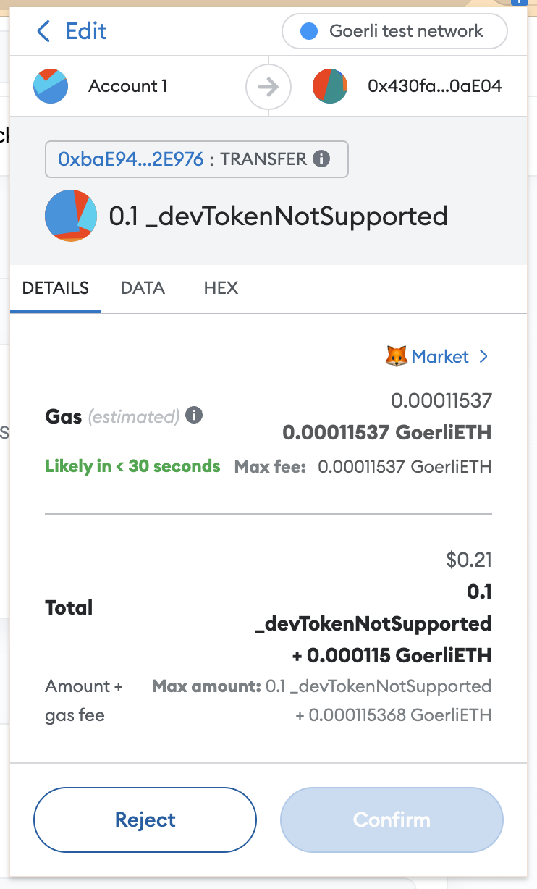
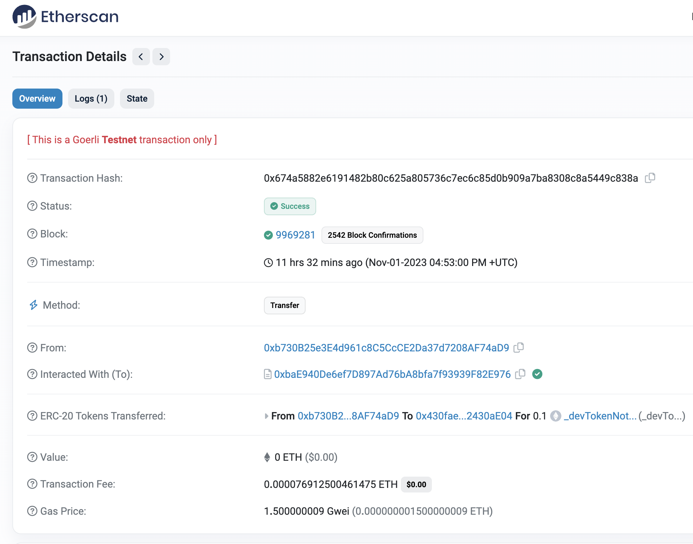
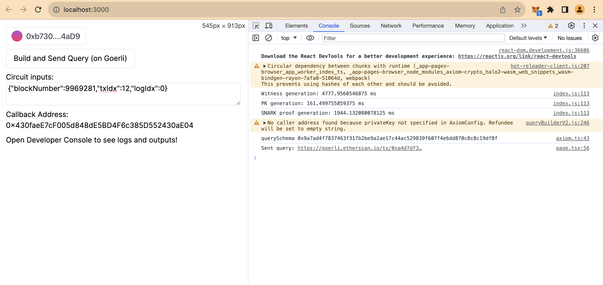
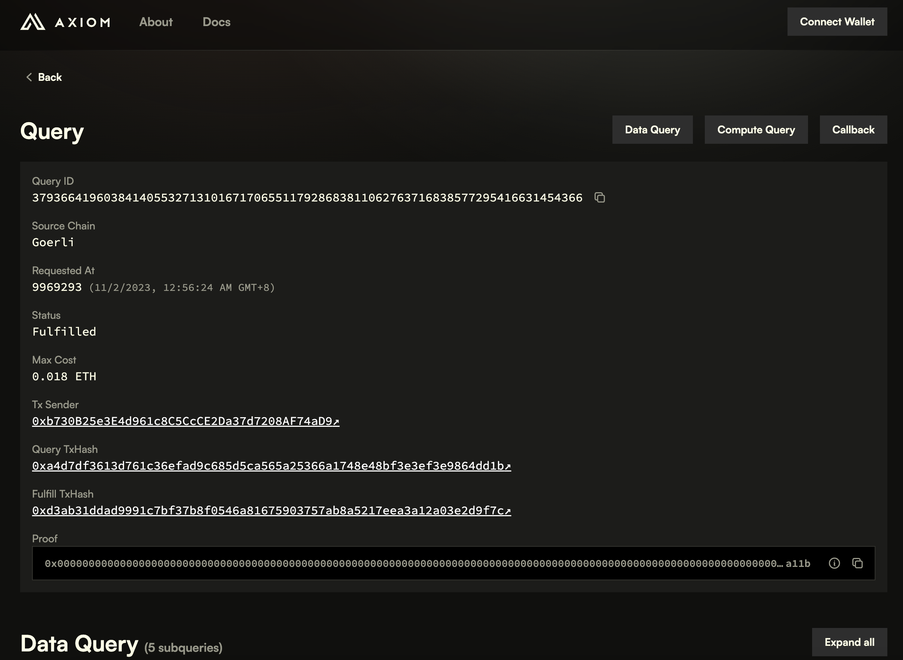
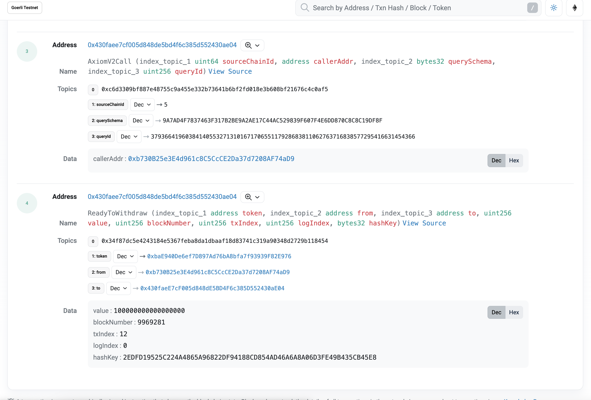
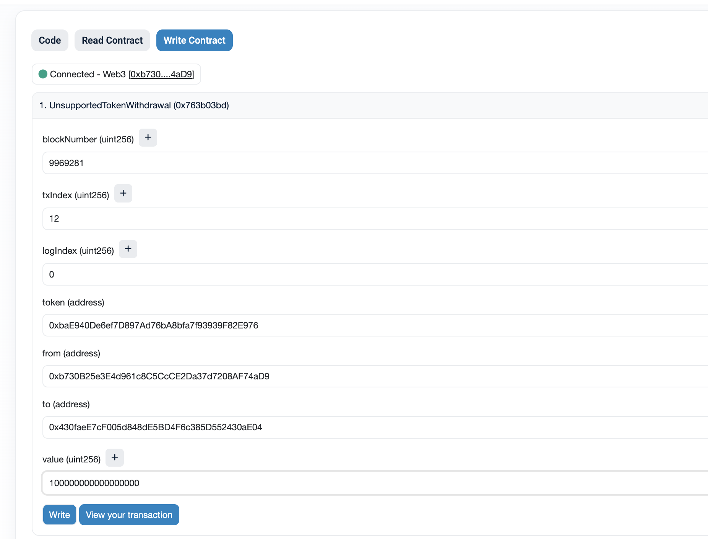
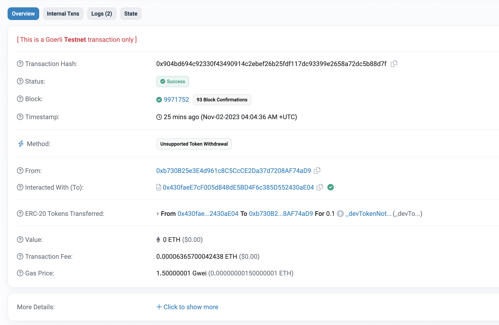

# Unsupported Asset Retrieval

## Background

Typically, a smart contract protocol receives user assets through specific functions and predefined processes. If a user fails to adhere to these predefined processes, any assets they transfer into the protocol become irretrievable.

Thankfully, with the introduction of AxiomRepl, users can retrieve their lost assets without compromising the security of the protocol.

Consider a simple example: a smart contract designed to accept specific ERC20 deposits from users.

```solidity
// SPDX-License-Identifier: MIT
pragma solidity ^0.8.21;

import "@openzeppelin/contracts/token/ERC20/IERC20.sol";
import "@openzeppelin/contracts/token/ERC20/utils/SafeERC20.sol";

contract SomeProtocol {
    using SafeERC20 for IERC20;

    event Deposit(address indexed user, uint256 amount);
    event Withdrawal(address indexed user, uint256 amount);

    mapping(address => uint256) public balances;
    IERC20 public immutable allowedToken;

    constructor(IERC20 _allowedToken) {
        allowedToken = _allowedToken;
    }

    function deposit(uint256 amount) external {
        allowedToken.safeTransferFrom(msg.sender, address(this), amount);
        balances[msg.sender] += amount;
        emit Deposit(msg.sender, amount);
    }

    function withdrawal(uint256 amount) external {
        require(balances[msg.sender] >= amount, "insufficient balance");
        balances[msg.sender] -= amount;
        allowedToken.safeTransfer(msg.sender, amount);
        emit Withdrawal(msg.sender, amount);
    }
}
```

In this scenario, users face a risk: depositing assets in ways other than calling the `deposit()` function makes the assets irretrievable. For instance, if a user directly transfers ERC20 tokens to the `SomeProtocol` contract, those tokens become locked and inaccessible.

To address this challenge, we introduce AxiomRepl. By proving to `SomeProtocol` that a user has made an unsupported token transfer, AxiomRepl allows the user to retrieve the corresponding assets.

For supported tokens (like `allowedToken`), if users accidentally deposit assets outside the `deposit()` function, the retrieval process might be more intricate. A possible scenario involves user Alice staking tokens as collateral for a retrieval claim, with a 1-day challenge window. If, within this period, user Bob (or any user) can provide a zero-knowledge proof that User Alice's deposit transaction contains the `event Deposit(address indexed user, uint256 amount)`, it implies user Alice acted dishonestly. As a result, user Bob receives all of user Alice's collateral. Given the complexity of this scenario, we don't plan to include it in the current demo.

## Code Structure

- **AxiomRepl:** [Link to AxiomRepl](https://repl.axiom.xyz/?gist=966aacec3eff95abae5c31a6d5f705ce)
  
- **Smart Contract:** [UnsupportedAssetRefundProtocol on GitHub](https://github.com/jayden-sudo/UnsupportedAssetRefund/tree/main/src)
  
- **Test Transaction:** [Transaction on Goerli Etherscan](https://goerli.etherscan.io/tx/0x904bd694c92330f43490914c2ebef26b25fdf117dc93399e2658a72dc5b88d7f#eventlog)

---

## UnsupportedAssetRefund Protocol Demonstration

This demonstration shows how the UnsupportedAssetRefund Protocol can be used to refund unsupported ERC20 tokens that were sent to the protocol. Follow the steps below to see how the process works.

### Prerequisites

Before you begin, make sure you have the following installed:

- [Node.js](https://nodejs.org/)
- [Yarn](https://yarnpkg.com/)

### Step-by-Step Guide

#### 1. Transfer Unsupported ERC20 Token

Transfer an unsupported ERC20 token to the UnsupportedAssetRefundProtocol smart contract to simulate a deposit that needs to be refunded.

- 
- 

- ERC20 Token Address: [0xbaE940De6ef7D897Ad76bA8bfa7f93939F82E976](https://goerli.etherscan.io/address/0xbaE940De6ef7D897Ad76bA8bfa7f93939F82E976#readContract)
- UnsupportedAssetRefundProtocol Address: [0x430faeE7cF005d848dE5BD4F6c385D552430aE04](https://goerli.etherscan.io/address/0x430faeE7cF005d848dE5BD4F6c385D552430aE04#code)

Transaction Example:

- TX Hash: [0x674a5882e6191482b80c625a805736c7ec6c85d0b909a7ba8308c8a5449c838a](https://goerli.etherscan.io/tx/0x674a5882e6191482b80c625a805736c7ec6c85d0b909a7ba8308c8a5449c838a)

#### 2. Submit zk Proof

Submit a zero-knowledge proof to the protocol to initiate the refund process.

1. Navigate to the `web` folder and start the development server:

   ```sh
   yarn dev
   ```

2. Open your browser and go to `localhost:3000`.

3. Enter the transaction details of the unsupported token transfer:

   ```json
   {"blockNumber":9969281,"txIdx":12,"logIdx":0}
   ```

4. Click on "Build and Send Query (on Goerli)".

   1. 
   2. Proof Transaction:
      1. TX Hash: [0xa4d7df3613d761c36efad9c685d5ca565a25366a1748e48bf3e3ef3e9864dd1b](https://goerli.etherscan.io/tx/0xa4d7df3613d761c36efad9c685d5ca565a25366a1748e48bf3e3ef3e9864dd1b)


#### 3. AxiomRepl Callback

After the proof is submitted and verified, AxiomRepl will initiate a callback request.

- 
- 

- Axiom Explorer Query: [Axiom Explorer Link](https://explorer.axiom.xyz/v2/goerli/mock/query/37936641960384140553271310167170655117928683811062763716838577295416631454366)
- Corresponding Etherscan Transaction: [0xd3ab31ddad9991c7bf37b8f0546a81675903757ab8a5217eea3a12a03e2d9f7c](https://goerli.etherscan.io/tx/0xd3ab31ddad9991c7bf37b8f0546a81675903757ab8a5217eea3a12a03e2d9f7c#eventlog)

#### 4. Initiate UnsupportedTokenWithdrawal

The user can now initiate a withdrawal of the unsupported token.

Withdrawal Transaction:

- 
- 
- TX Hash: [0x904bd694c92330f43490914c2ebef26b25fdf117dc93399e2658a72dc5b88d7f](https://goerli.etherscan.io/tx/0x904bd694c92330f43490914c2ebef26b25fdf117dc93399e2658a72dc5b88d7f)


This demonstration outlines the process of refunding unsupported ERC20 tokens using the UnsupportedAssetRefund Protocol. By following the steps above, users can retrieve their tokens safely and efficiently.
